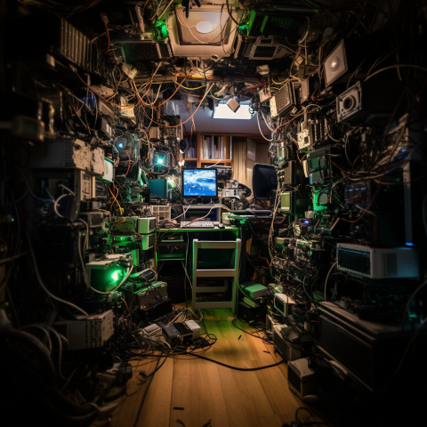

# Homelab Ops

     

So I've got this broken down into several parts.
1. [Ansible](./ansible/)
   1. [For setting up monitoring](./ansible/playbooks/install-monitoring.yml) and use [this](./ansible/inventory/hosts) list.
2. [Kubernetes](./kubernetes/)
3. [Terraform](./terraform/)